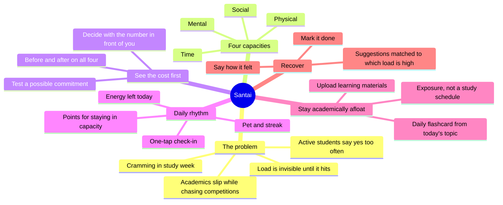
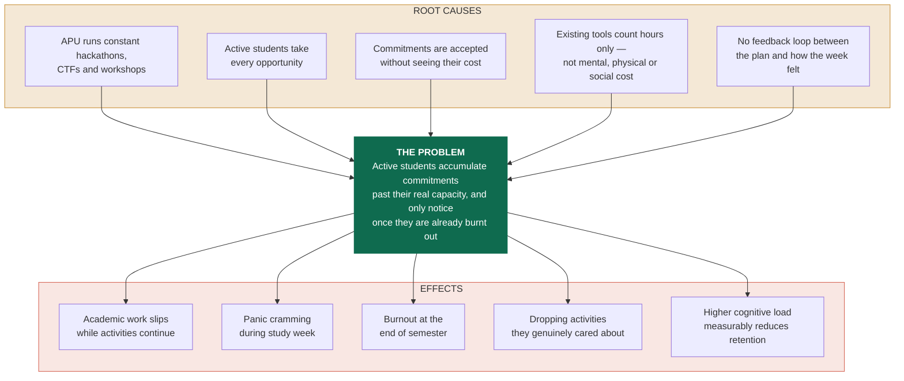
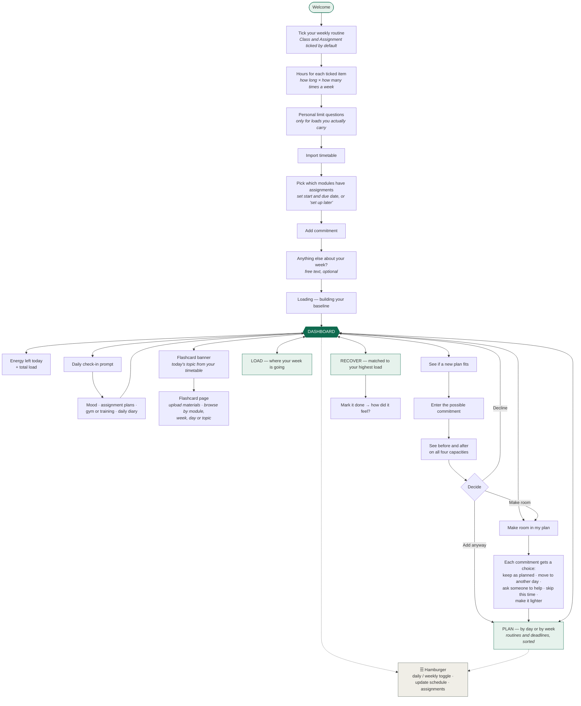
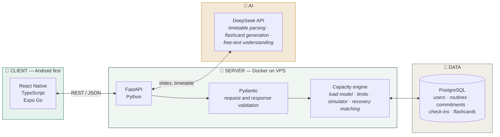
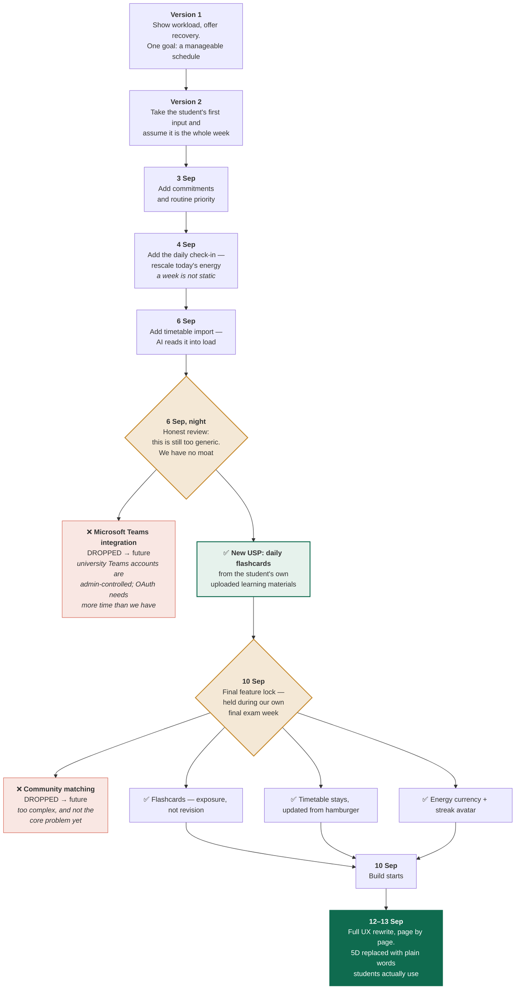
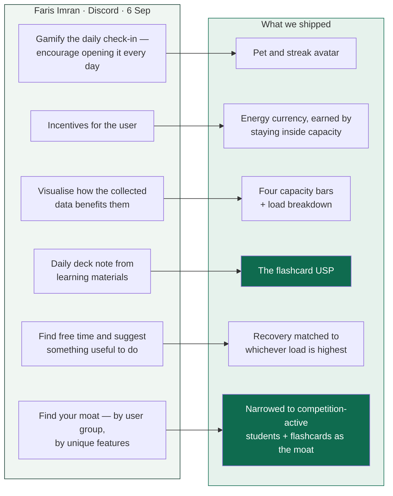
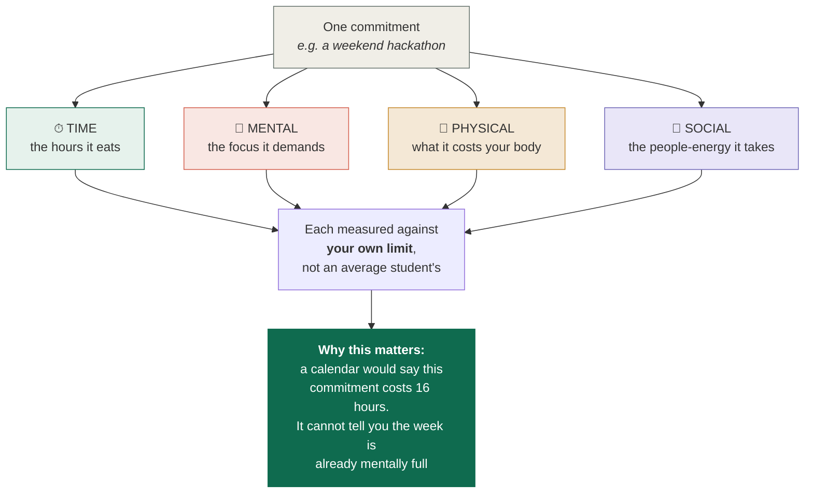

# Santai — README diagrams

**These are Mermaid diagrams.** GitHub renders them natively inside `README.md` — no image files, no
broken links, and they stay version-controlled. Paste each block straight into the README.

If any block fails to render on GitHub, tell me and I will convert that one to an SVG image.

---

## 1. Mindmap — the core idea and its branches
*(Ideation 8% — "rich, multi-layered mapping")*

---

## 2. Problem tree — causes, problem, effects
*(Impact 5% — "causes, stakeholders, real-world implications")*

---

## 3. User flow — setup through daily use
*(Ideation 8% + Design 2% "covers the core flow end-to-end")*

---

## 4. Architecture
*(Feasibility 6% — "appropriate technologies, realistic implementation")*

---

## 5. Iteration timeline — how the idea evolved
*(Ideation 7% — "multiple documented iterations, including dropped directions")*

---

## 6. Mentor feedback → what we built
*(Ideation 7% — "feedback clearly documented and meaningfully incorporated")*

**The line that matters:** he told us to find a moat on 6 September. The 10 September meeting
was us doing exactly that.

---

## 7. What the four capacities are, and why four
*(Creativity 7% + Impact 7%)*

