# Santai by TokenHabisBro

**Team:** Ayman Al Mursyid Bin Mohd Puzhi, 
          Noor Khairul Azizi Bin Noor Azman, 
          Muhammad Hadi Hilmi Bin Mohamad Hamdan, 
          Muhammad Danial Fitri Bin Mohd Khairizal 

**Problem Statement:** Stress & Workload Manager (Track 1)

**Video Presentation:** _to be added_

**Presentation Slides:** _to be added_

## 1. Project Overview

### The Problem

The brief we were given:

> "Build an app that gives students a clear picture of their load across different areas (mental, time, physical, social, errands) and actually helps them do something about it before burnout hits. It shouldn't just track and report. Instead, it should help students rebalance what they're carrying and push them toward recovery, like rest or getting out of the house. Make sure it's usable, accessible, and something students would actually keep open on their phone."

At APU something is always on. The students who say yes to all of it get the most out of university and lose ground in the subjects they enrolled in. All four of us are those students, and we built this during our own final exam week.

What causes it:

- Opportunity never stops. You are one message away from another commitment.
- You agree before you can see the cost.
- A week never feels full while you plan it. It feels full once you are in it.
- Calendars count hours. Sixteen booked hours says nothing about whether your head is already full.
- Nothing asks how the week went, so the next one starts on the same wrong assumptions.

**Stakeholders**

| Stakeholder | How the problem affects them |
|---|---|
| Active students (us) | Carry every commitment at once and only find the breaking point after they hit it |
| Universities | Capable students underperform in subjects they could otherwise pass easily |
| Clubs and societies | Members who were reliable in week 1 go quiet by week 8 |
| Lecturers | Teach a room of students seeing the material for the first time at finals |

**What already exists**

- **Google Calendar** blocks time but knows nothing about weight. Two hours of lab and two hours of group presentation look identical.
- **Notion** models anything, so it models nothing until you build it. Maintaining it becomes its own commitment.
- **Reclaim.ai and Motion** are the real competition. Both auto-schedule and reschedule, and Reclaim does defend rest. Neither models capacity, both measure time only, and Motion costs $19/month with no free plan. Built for knowledge work, not a student timetable.
- **Todoist** tracks tasks. A finished list says nothing about whether the week was survivable.

None of them answer the question that matters before you say yes: what will this cost me?

### Our Solution

Santai is built for one group: students always signed up for something, whether that is hackathons, CTFs, society work or part-time jobs. It tracks your week across four loads (time, mental, physical, social) against limits built from your own routine, not an average student's. Test a new commitment before you say yes and watch all four move. Because our users skip lectures for competitions, it also turns their own materials into one flashcard a day.

- **Four capacities** - each measured against your own limit
- **Test before you commit.** - All four numbers before and after, saving nothing until you confirm
- **Daily check-in.** Stress, assignment intent and percentage, training. Today overrides setup
- **Energy leaf and total load**
- **Daily flashcards** - from your own materials, matched to today's class
- **Timetable import.** - Upload once, holds until you change it
- **Five ways to make room:** - keep, move, ask for help, skip, make lighter
- **Recovery by day.** - Seven days, matched to your tightest capacity, then asks if it helped
- **Pet, streak and energy currency** - that grow when your week stays inside its limits

Two notes on how we read the brief. It never mentions grades, but for our users load and grades are the same problem, which is why flashcards are on that list. A team building for students in general has no reason to add them. The brief also lists five load areas and we show four bars. Errands still sit in the model and feed time and physical load, but five bars read worse than four at a glance, and errands were always our smallest number.

## 2. Ideation & Process

### 2.1 Ideas We Considered

| Idea | Why kept or dropped |
|---|---|
| **Four-capacity model** *(Chosen)* | One number can't say if a week is heavy in hours or heavy in your head. |
| **Test before you commit** *(Chosen)* | Users commit in seconds. Reporting load after is too late. |
| **Daily flashcards from your own materials** *(Chosen, 6 Sep)* | Our USP. Exposure, not revision. A missed lecture shouldn't mean a blank page in study week. |
| **Daily check-in** *(Chosen, 4 Sep)* | Our first model assumed one setup answer held forever. Real weeks aren't static. |
| **Timetable import** *(Chosen, 6 Sep)* | Typing a semester by hand kills a planner in week two. |
| **Energy currency and pet streak** *(Chosen, 10 Sep)* | Mentor feedback. Grows when you stay *inside* your limits, so it rewards balance, not usage. |
| **Workload distribution pie chart** *(Dropped, 12 Sep)* | Repeated what the four bars already said. Cut in the UX pass. |
| **Separate Load tab** *(Dropped, 12 Sep)* | Was in our first design. The dashboard already showed it, so the tab was one nav slot wasted. |
| **Microsoft Teams integration** *(Dropped, future)* | University Teams accounts are admin-controlled. OAuth approval would outlast the prototype phase. |
| **Community matching** *(Dropped, future)* | Recover together with friends. Not the core problem yet. |
| **Currency shop with pet skins** *(Dropped, future)* | Spend earned energy currency on cosmetics. Fun, but it doesn't solve load. |
| **A traditional AI study scheduler** *(Dropped)* | A rigid schedule is the exact thing we're preventing. |
| **Travel planner** *(Dropped, other track)* | Chose the problem we were living through while building. |

### 2.2 Ideation Boards

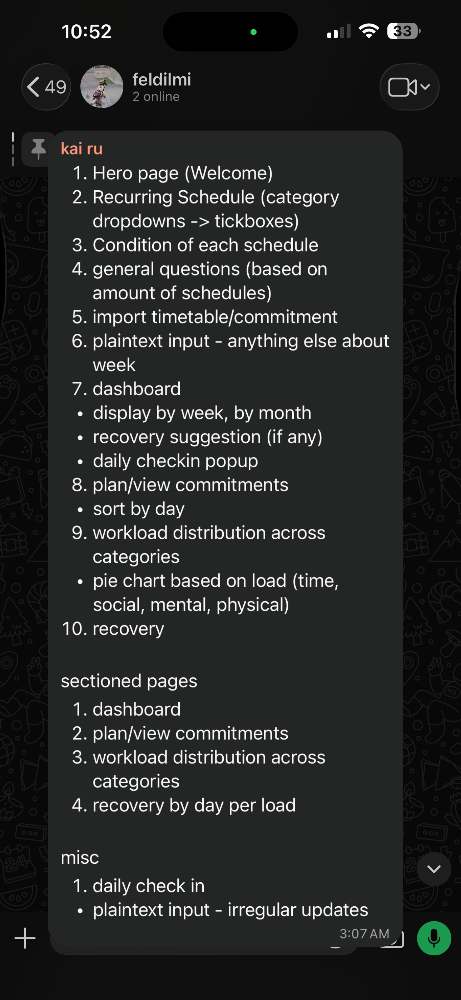

*3:07am, our first full scope in the group chat. Ten numbered pages, most of which shipped. Item 9, the workload distribution pie chart, is the one we later cut.*

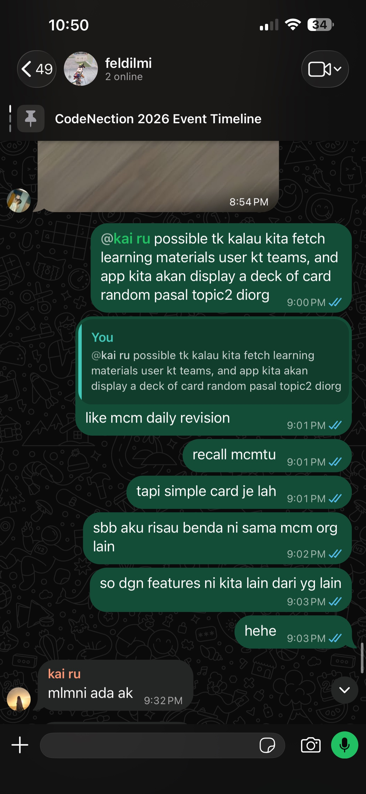

*6 Sep, the flashcard idea being born. "sbb aku risau benda ni sama mcm org lain" means "because I'm worried this is the same as everyone else's". The next message answers it: "so dgn features ni kita lain dari yg lain".*

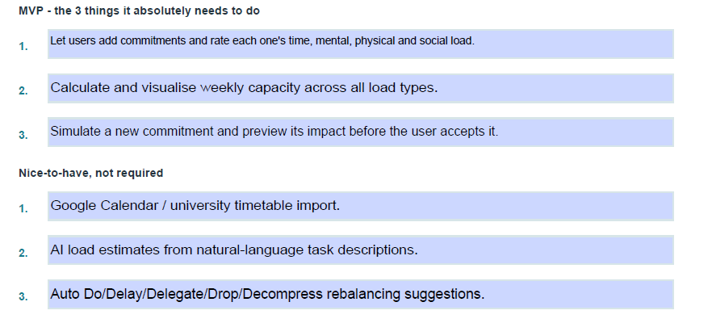

*Cutting scope to an MVP. Calendar import, AI load estimation from free text and automatic rebalancing all moved to nice-to-have. Two of the three came back later once we had time.*

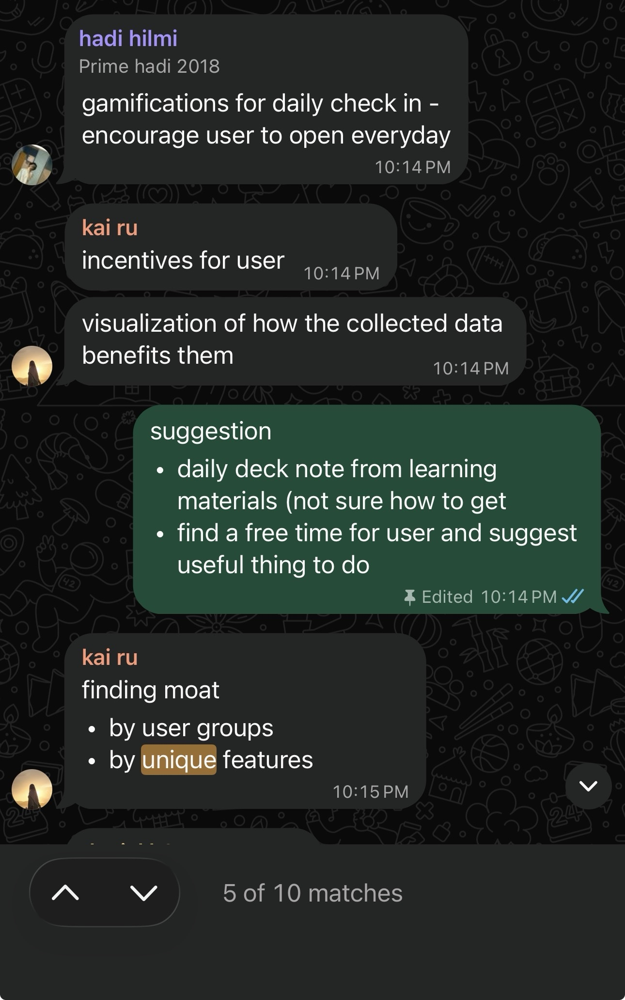

*Our notes from the mentor session, written up in the team chat the same night. Every line in 2.3 traces back to this.*

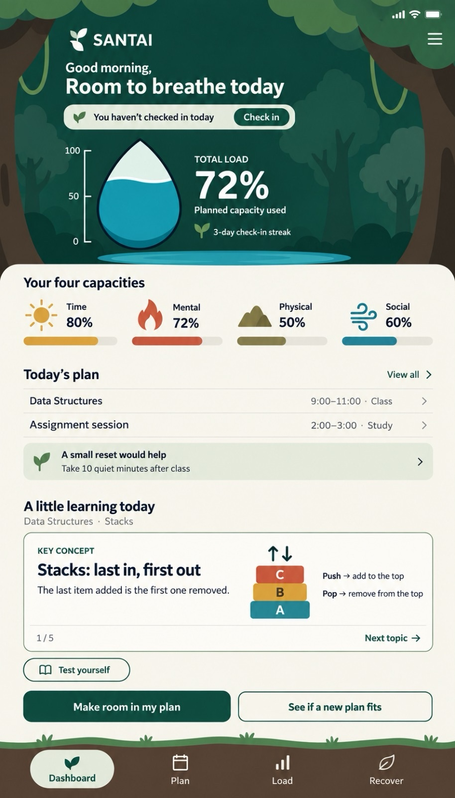

*Our first design, before the build. Four tabs including a Load tab, and 5D vocabulary on the buttons. Both were gone by 12 Sep.*

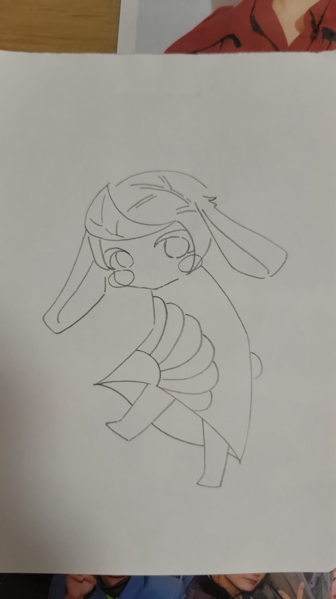

*An early mascot sketch. We wanted a character a student opens daily, not a workload report. The final sprout came out of this pass.*

**Problem Tree**

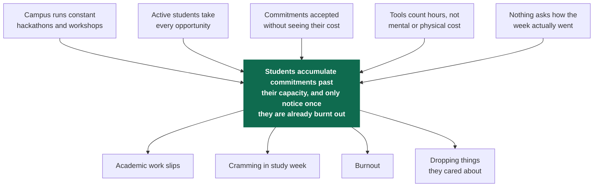

*Problem tree. Our four-capacity model answers C4 and the daily check-in answers C5.*

**Idea Evolvement**

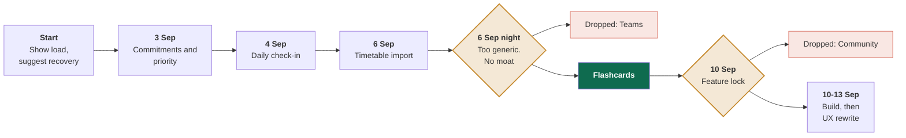

*How the idea evolved. Dropped directions in red. The 6 Sep meeting is where we admitted the project was generic.*

**Apps Flow**

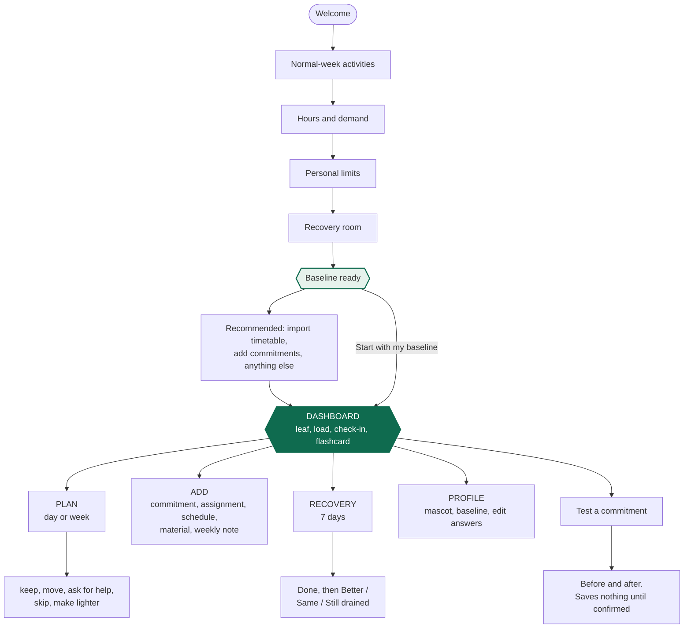

*User flow. Five setup screens, then you are in. Without a timetable it cannot show today's flashcard, so the optional steps are recommended.*

### 2.3 Mentor Consultation

| Date | Mentor | Feedback Received | What Was Changed |
|---|---|---|---|
| 6 Sep | Faris Imran | Gamify the daily check-in to get users opening it every day | Pet and streak avatar |
| 6 Sep | Faris Imran | Give the user incentives | Energy currency, earned by staying inside your limits |
| 6 Sep | Faris Imran | Visualise how the collected data benefits them | Energy leaf and four capacity bars on the dashboard |
| 6 Sep | Faris Imran | Daily deck note from learning materials | **Became our USP.** One card a day from the student's own materials |
| 6 Sep | Faris Imran | Find free time and suggest something useful | Recovery page, matched to the tightest capacity, with a "did it help?" follow-up |
| 6 Sep | Faris Imran | Find your moat, by user group and by unique features | Sent us into the 10 Sep meeting. Narrowed from "students" to "students who compete and fall behind" |

The moat comment is why this project has a shape. He told us to find one on the 6th and the 10 Sep meeting was us doing it.

## 3. Design & Prototype

**UI Prototype:** https://santai.rxyru.my/

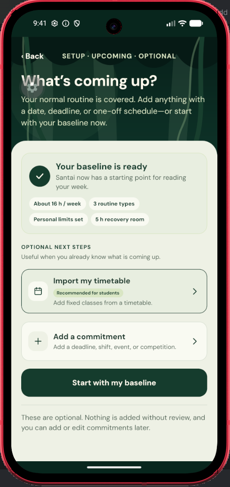

**Baseline ready.** Setup ends here: 16h/week routine, personal limits set, 5h recovery room. Importing a timetable or adding a commitment is offered, not forced.

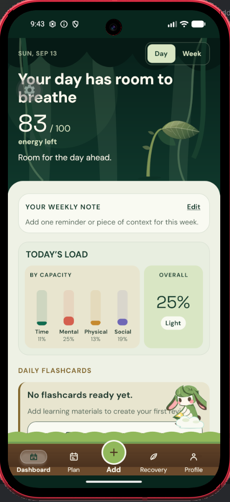

**Dashboard.** 83/100 energy left today, above the week's load split into four capacity bars. Bottom nav is Dashboard, Plan, Add, Recovery, Profile.

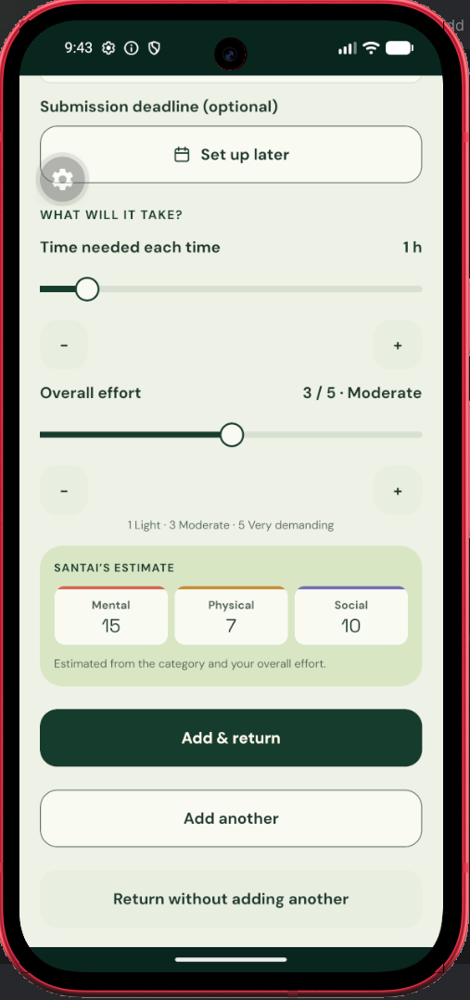

**Adding a commitment.** Set time needed and overall effort, then Santai estimates the mental, physical and social cost before you confirm.

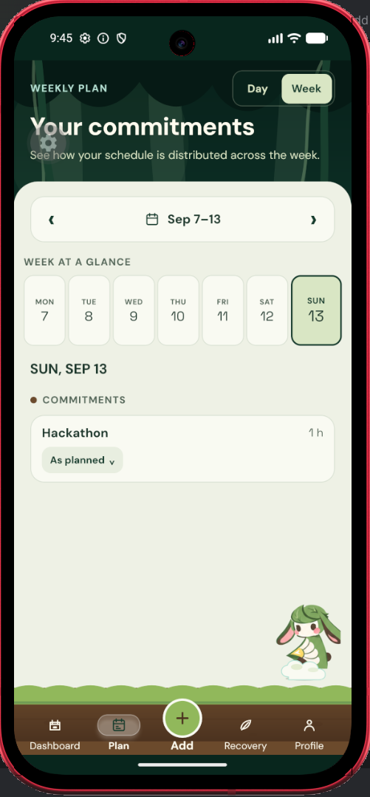

**Plan.** Week view with commitments on their day and their current status. Every item can be kept, moved, handed over, skipped or made lighter.

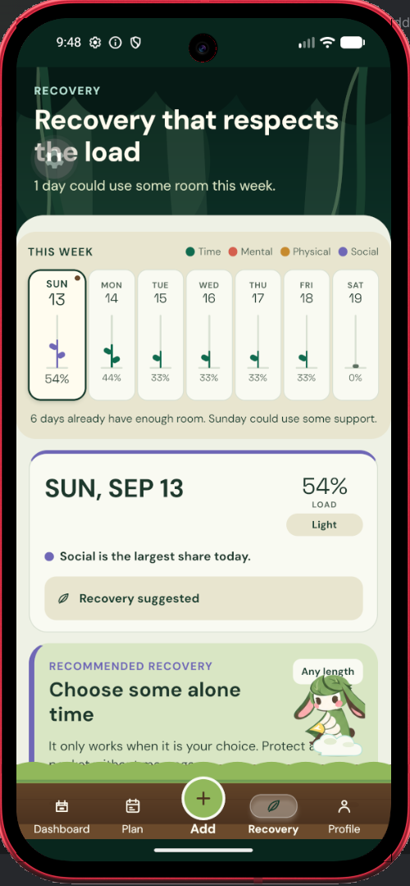

**Recovery, triggered.** Sunday's load crosses the line, so a matched suggestion appears. Here it is alone time, because social load is the tight one.

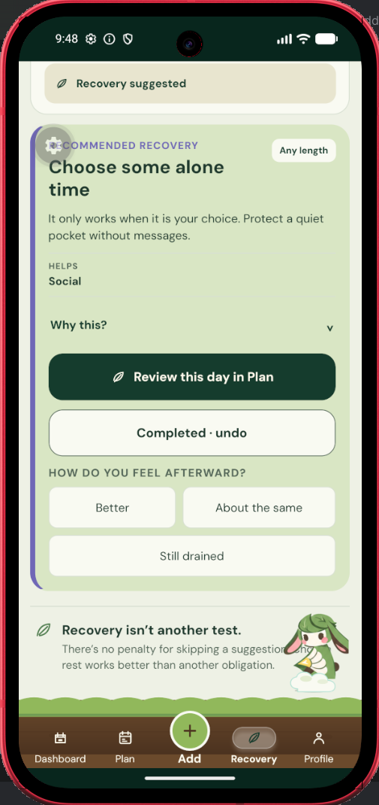

**Recovery, closed out.** Mark it done, then say how it felt: Better, About the same, or Still drained.

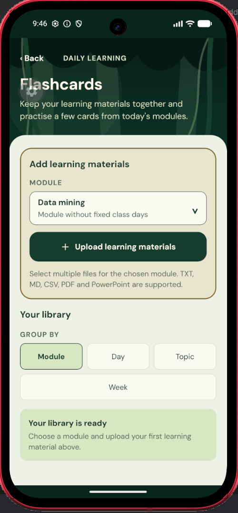

**Flashcards.** Upload materials against a module, then pull cards from what you uploaded. Grouped by module, day or topic.

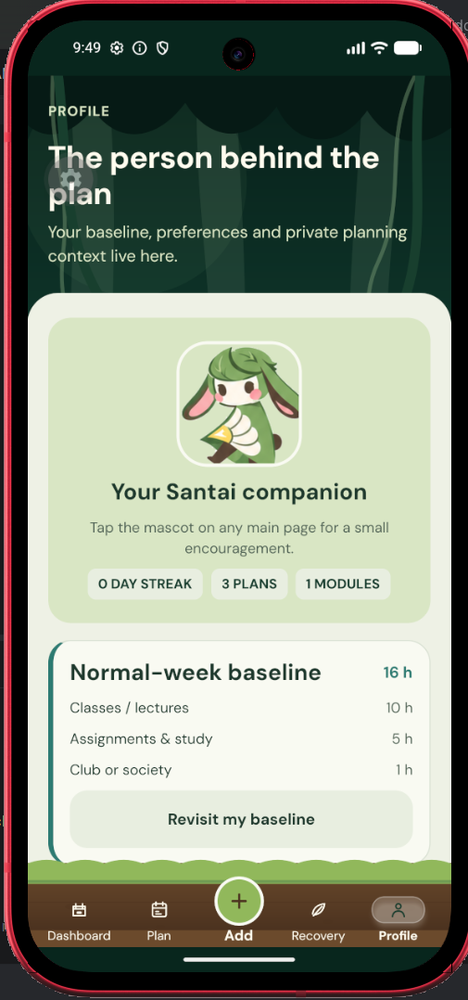

**Profile.** Mascot, streak, plan count and your baseline answers, editable without redoing setup.

## 4. What Makes It Different

- **Four capacities, not one number.** Everyone else measures time. Same timetable, two students, different limits.
- **You see the price before you pay.** A calendar says the hackathon is 16 hours. Santai says it breaks your mental ceiling and takes your only free evening.
- **Flashcards for exposure, not revision.** Every study app builds you a schedule. We refused, because a rigid schedule is what we're protecting students from.
- **Rewards for staying inside your limits**, not for opening the app. Most gamification pays for engagement. Ours pays for balance.
- **Recovery that knows what's draining you.** High social load doesn't get a suggestion to go see friends.
- **Plain words.** We built a five-way priority system, then dropped its vocabulary. Nobody thinks "delegate" and "decompress".

### Compared with what exists

We checked these rather than assumed. Some do more than we expected.

| | Google Calendar | Notion | Reclaim.ai | Motion | **Santai** |
|---|---|---|---|---|---|
| Schedules your time | Yes | If you build it | Automatically | Automatically | Manually |
| Protects rest | If you block it | If you build it | **Yes** | Not documented | Yes, and suggests what kind |
| Reschedules when plans slip | No | No | **Yes** | **Yes** | **No** |
| Measures mental, physical, social | No | If you build it | No | No | Yes |
| Warns before you are over capacity | No | No | No ceiling | Not documented | Yes |
| Limits from your own routine | No | No | No | No | Yes |
| Adapts to how the day felt | No | No | On conflicts only | On conflicts only | Yes |
| Keeps you academically afloat | No | Templates, AI Q&A | No | No | Yes |
| Free for a student | Yes | Free tier | Limited free tier | **$19/month** | Yes |
| **Mature product** | **Yes** | **Yes** | **Yes** | **Yes** | **No, prototype** |

**Where we lose.** Reclaim and Motion auto-schedule and reschedule, we don't. Google Calendar syncs with everything, we sync with nothing. All four are shipping products and we are a prototype.

**Where the gap is real.** None of them measure anything but time. None can tell you a week is mentally full before you agree to it, or care whether a student who skipped lectures for a competition can still follow their syllabus.

## 5. Technical Architecture & Feasibility

### Tech stack

- **React Native, TypeScript and Expo.** One codebase for Android, iOS and web, and QR-code testing with no store approval. *Constraint:* the managed workflow limits some native modules. Android first.
- **FastAPI and Pydantic.** Python our team already writes. Pydantic validates every payload, so a bad commitment can't corrupt a capacity number. *Constraint:* one VPS, single point of failure.
- **PostgreSQL.** The data is relational and Postgres handles the date math a weekly roll-up needs. *Constraint:* no backup or migration strategy yet.
- **Docker.** Four people, four machines, one week. *Constraint:* slower builds on older laptops.
- **DeepSeek API.** Reads timetables, generates flashcards, parses free text. Chosen for cost. *Constraint:* cost scales with uploads, so we cap file size. Still provisional until we benchmark it.
- **VPS at roughly RM30/month.** Docker Compose, cheap and predictable. *Constraint:* no CDN and no autoscaling.

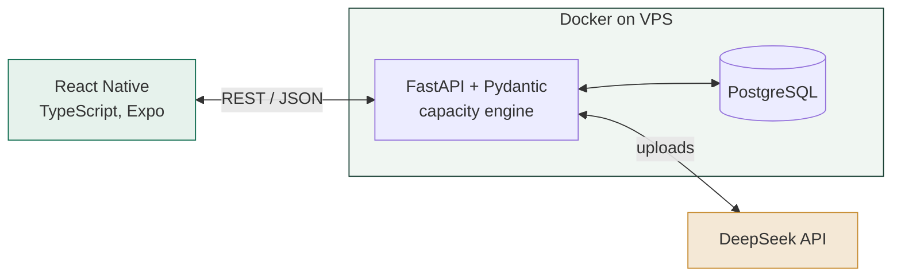

### Build plan & scope

What we build next:
1. **Flashcard pipeline.** Upload, extraction, card generation, stored against the right module and week, with a size cap and a visible failure state.
2. **Close the check-in loop** so today's answers move today's numbers.
3. **Recovery feedback.** Store whether a suggestion helped and rank future ones by it.
4. **More to come on Building Phase**

Not in this phase: Teams integration, community matching, push notifications, iOS release.

**Resources.** Four people, 32 hours of build so far, done during our own exam week. RM30/month hosting plus a small AI bill once the model is benchmarked.

**Risks.** Flashcard quality depends on how clean the uploaded materials are. One VPS is a single point of failure. Neither blocks the phase.

### After this phase

| What | Why deferred | What it unlocks |
|---|---|---|
| **Push notifications** | Nearest term | Turns Santai from a tool you remember into a habit |
| **Pet upgrades** | Currency economy needs balancing first | Earned energy gets somewhere to go |
| **Offline flashcards** | Needs local caching | Revision on a commute |
| **iOS build** | Android first while we validate | Doubles reachable students |
| **Teams integration** | Admin-controlled accounts, OAuth | Materials and timetable with zero manual upload |
| **University integration** | Needs an institutional agreement | Always-current timetable, no extra database |
| **Community matching** | Complex, not the core problem yet | Recovering with friends, which is how students actually rest |

