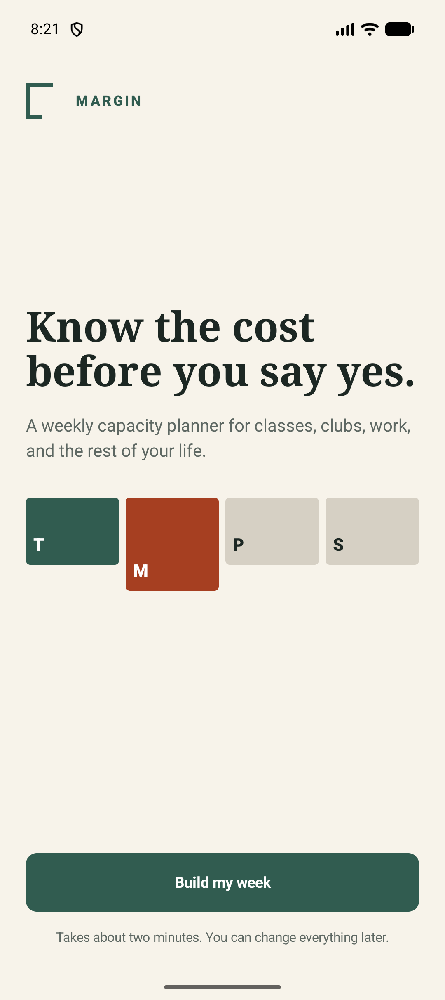
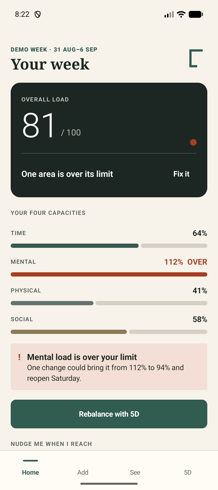
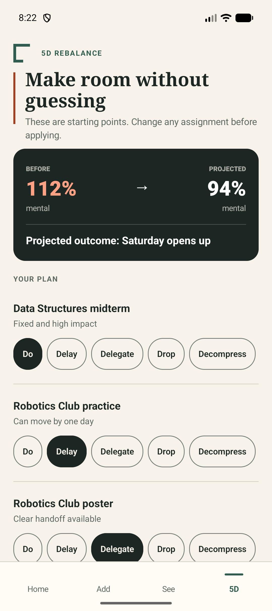
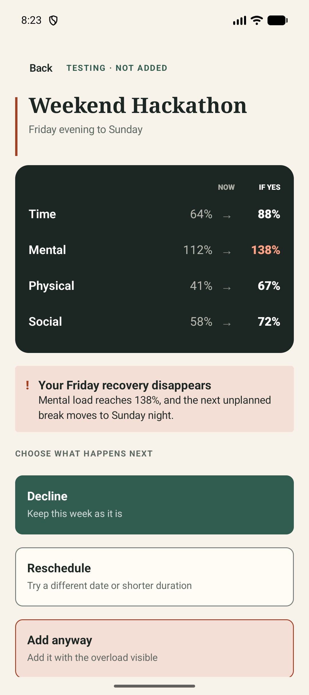
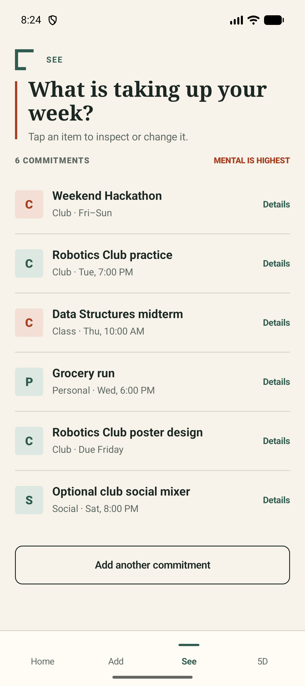

# Margin Android MVP

**Status:** Implemented and verified

**Platform:** Native Android

**Technology:** Kotlin and Jetpack Compose
**Track:** Lifestyle Track: Beating the Burnout

Margin helps highly involved university students see the cost of saying yes before adding another commitment to their week.

## Implemented MVP

- Full 12-screen onboarding and application flow.
- Persistent Home, Add, See, and 5D navigation.
- Four capacity dimensions: time, mental, physical, and social.
- Overall Load Index with a clear overload warning.
- Editable 5D recommendations: Do, Delay, Delegate, Drop, and Decompress.
- Functional what-if commitment simulator.
- Hypothetical commitments remain separate until the user confirms them.
- Confirmed commitments can be edited and removed from the shared week state.
- Timetable import with loading, success, and recoverable error states.
- Natural-language week entry with extracted commitments and difficulty cues.
- Empty commitment-list handling.
- Accessible text contrast and primary touch targets of at least 48dp.
- Semantic roles and state labels for tabs, choices, expandable rows, capacity status, and import feedback.
- Seeded figures are clearly labeled as a demo week.
- A distinct editorial “margin” identity instead of a generic card dashboard.

## Screen inventory

1. Get started
2. Setup method chooser
3. Import timetable
4. Add commitment during onboarding
5. Describe a week
6. Check personal limits
7. Home
8. Add
9. See
10. 5D rebalance
11. Test a commitment
12. What-if simulator

Only Home, Add, See, and 5D display the persistent bottom navigation.

## Deliverables

- [Project README](README.md)
- [Design rationale and visual system](DESIGN.md)
- [Android source](app/src/main/java/com/codenection/breathe)
- [Debug APK](app/build/outputs/apk/debug/app-debug.apk)
- [Android lint report](app/build/reports/lint-results-debug.html)

The APK and lint report are generated build artifacts. Run the build command below if they are missing after a Gradle clean.

## Final previews

### Welcome



### Weekly capacity dashboard



### 5D rebalance



### What-if simulator



### Confirmed commitments



## Recommended judging demo

1. Select **Add one by one** and review the four personal capacity limits.
2. On Home, highlight the **81 / 100 Overall Load** and mental capacity at **112%**.
3. Open **5D Rebalance**, change one recommendation, and apply the plan.
4. Select **Test another commitment** and test the Weekend Hackathon.
5. Compare the **Now** and **If Yes** values in the simulator.
6. Explain that Friday recovery disappears and mental load rises to **138%**.
7. Select **Add anyway**.
8. Confirm that Weekend Hackathon now appears in **See**. It was not listed while hypothetical.
9. Expand the item, edit its load, save it, then remove it.

## Verification

| Check | Result |
| --- | --- |
| Debug APK build | Passed |
| Unit tests | Passed |
| Android lint | Passed |
| WCAG text contrast | Passed |
| Emulator onboarding flow | Passed |
| 5D interaction flow | Passed |
| Simulator and confirmation flow | Passed |
| Import error, loading, and success states | Passed |

Android lint reports three informational version-update warnings for Gradle and AndroidX dependencies. There are no blocking lint errors.

## Build and run

Open the `android-app` directory in Android Studio and run the `app` configuration on an emulator or physical Android device.

PowerShell build command:

```powershell
$env:JAVA_HOME = 'C:\Program Files\Android\Android Studio\jbr'
.\gradlew.bat testDebugUnitTest lintDebug assembleDebug
```

Generated APK:

```text
app/build/outputs/apk/debug/app-debug.apk
```

## Important source files

- `Capacity.kt`: capacity and commitment data models.
- `BreatheApp.kt`: application state and screen navigation.
- `OnboardingScreens.kt`: setup, import, manual entry, description, and limits.
- `DashboardScreens.kt`: Home, Add, and See tabs.
- `RebalanceScreens.kt`: 5D flow, commitment test, and simulator.
- `UiComponents.kt`: reusable UI and navigation components.
- `Theme.kt`: colors and typography.

## Product language

- Use **Overall Load** or **Load Index**.
- Do not describe the value as a medical diagnosis or a “Burnout Score.”
- Describe recommendations as starting points that the student can change.
- Keep hypothetical commitments outside the active week until explicitly confirmed.
